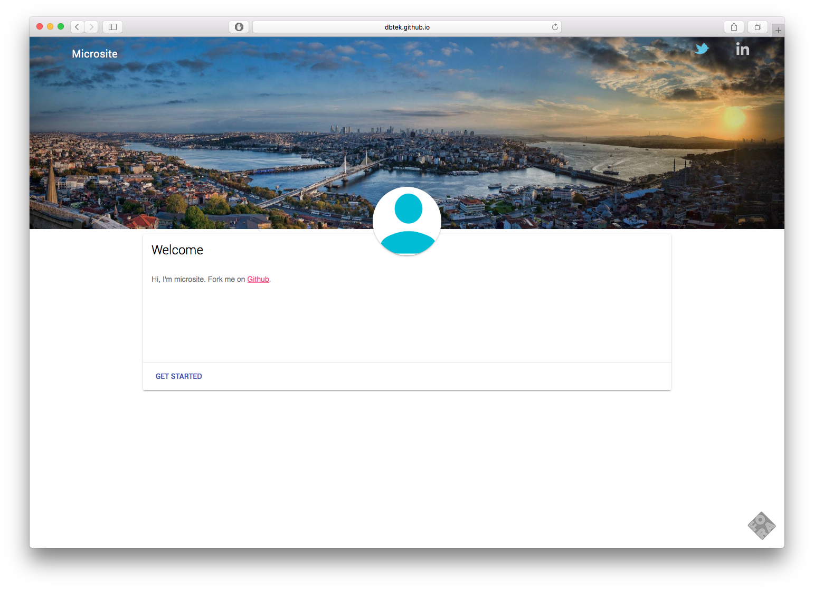

microsite
---------
Personal micro home page template. Runs on Github Pages, built on Material Design Lite.

## How?
- Fork the repo.
- Rename repo as USERNAME.github.io
- That's it, web site is published at USERNAME.github.io. Enjoy!

## Author
İsmail Demirbilek - [@dbtek](https://twitter.com/dbtek)
